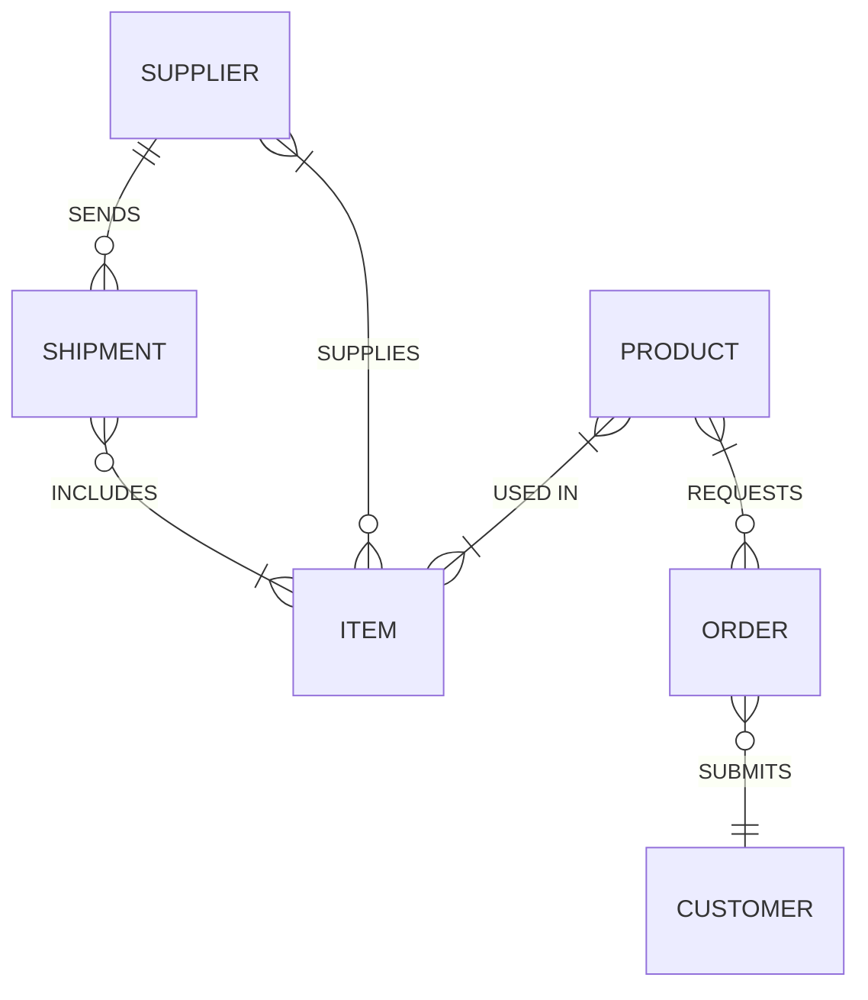

### > [Table of Contents](main.md)
# CC105
---
## Entity Relationship Modeling
- Concept and Definition
	- An Entity-Relationshtip (ER) model is the mainstream approach for conceptual data modeling.
	- The ER model is a detailed, logical representation of the data for an organization or for a business area.
	- Expressed in terms of entities in the business, the relationships—or associations—among these entities, and the attributes—or properties—of both the entities and their relationships.
	- Normally expressed as an ER diagram, which is a graphical representation of an ER model
- Sample Entity Relationship diagram (Mermaid)

- Entity-Relationship Model Notation Symbols
![[CC105-0.png]]
- Entity-Relationship Model Notation Relationship Degree
![[CC105-2.png]]
- Entity-Relationship Model Notation Relationship Cardinality
![[CC105-1.png]]

## Entity-Relationship Model Constructs

%%
- Requirement Analysis
  - Where the needed requirements are.
  - What do they need according to them.
  - What do they need according to an IT specialist
  - Requirements:
	  - Data
	  - Business Rules
		  - Sales
			  - Points of Sale
		  - Inventory
			  - Reorder Level
			  - Purchase Order
%%

<!-- what dows an IT Speciaist do -->